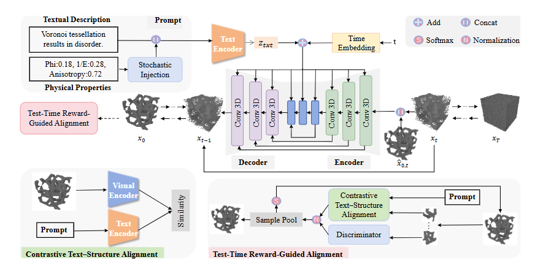

# Property-Informed Diffusion-Based Text-to-Microstructure Generation

## Project Overview
This project implements a 3D microstructure generation system based on a diffusion model, supporting **text-conditioned control** and **physical property-conditioned control**. The model can generate corresponding 3D voxel structures based on material descriptions and desired physical properties (volume fraction, elastic modulus, Poisson's ratio, etc.).



## Project Structure
```text
Propdiff-TMG/
├── train.py                 # Model training entry
├── generate.py              # Conditioned generation main program
├── refinement.py            # Reward-guided iterative refinement generation
├── chamfer.py               # Chamfer distance computation
├── FID.py                   # Evaluation metrics (FID, CLIP, classification accuracy)
├── discriminator.py         # Discriminator (for GAN-based evaluation/optimization)
├── p_evl.py                 # Physical property prediction error evaluation
├── figure.py                # Visualization (scatter plots + fitting lines)
├── temp.py                  # Temporary evaluation script (data splitting for FID after reward optimization)
├── network/                 # Network modules
│   ├── model_trainer.py     # Diffusion model trainer
│   ├── model_utils.py       # Basic network modules
│   ├── model.py             # Diffusion model
│   ├── classifier_net.py    # Classifier
│   ├── dual_encoder.py      # Vision-text dual encoder
│   ├── data_loader_text.py  # Text-conditioned data loader
│   ├── solver.py            # Property predictor
│   └── unet.py              # U-Net architecture
├── utils/                   # Utility functions
│   ├── mesh_utils.py        # Voxel to mesh (.obj) conversion
│   └── utils.py             # General utilities
└── data/                    # Data directory

## Environment Setup
```bash
conda env create -f environment.yaml
conda activate microstructure
```

## Datasets
下载数据集并放在 `data/` 目录：
- [Geometries 2000](https://drive.google.com/drive/folders/1GFdJIUzeH-zgFM6HAgNifzAZXmKrmJs5)
- [GenText-Microstruct](https://drive.google.com/drive/folders/1fNj_v-8YjtYCPoyXn6qZ-HzG0LqAJeV9)

## Train
```bash
TORCH_DISTRIBUTED_DEBUG=DETAIL CUDA_VISIBLE_DEVICES=0 python train.py --name debug/old --batch_size 4 --new True --continue_training True --image_size 64 --training_epoch 2000 --ema_rate 0.999 --base_channels 64  --save_last True --save_every_epoch 200 --with_attention True  --lr 2e-4 --optimizier adamw --verbose False --use_tensor_condition True
```

## Refinement
```bash
CUDA_VISIBLE_DEVICES=7 python refinement.py \
  --model_path /home/daibingxuan/workspace/microstructure_generation_3d/results/debug/textaddprop_aug/best-loss-epoch=1869-loss=0.1245.ckpt \
  --output_folder /home/daibingxuan/workspace/microstructure_generation_3d/evaluate \
  --dataset_path /home/daibingxuan/workspace/microstructure_generation_3d/data/datasets \
  --classifier_ckpt /home/daibingxuan/workspace/microstructure_generation_3d/training_result/classifier.pth \
  --batch_size 8 \
  --steps 50 \
  --num_generate 10 \
  --rounds 5 \
  --candidates 8 \
  --tensor_w 1.0 \
  --use_ema True
```
## Evaluation
```bash
python FID.py
```
## Inference
```bash
TORCH_DISTRIBUTED_DEBUG=DETAIL CUDA_VISIBLE_DEVICES=7 python generate.py --model_path /home/daibingxuan/workspace/microstructure_generation_3d/results/debug/textaddprop_aug/best-loss-epoch=1869-loss=0.1245.ckpt --generate_method generate_based_on_text  --num_generate 10 --steps 100 --tensor_w 1 
```
